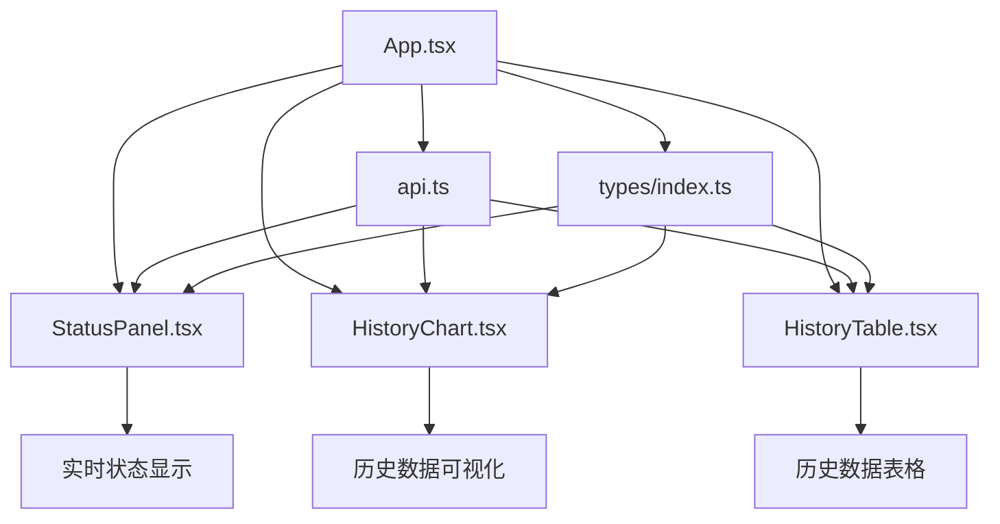
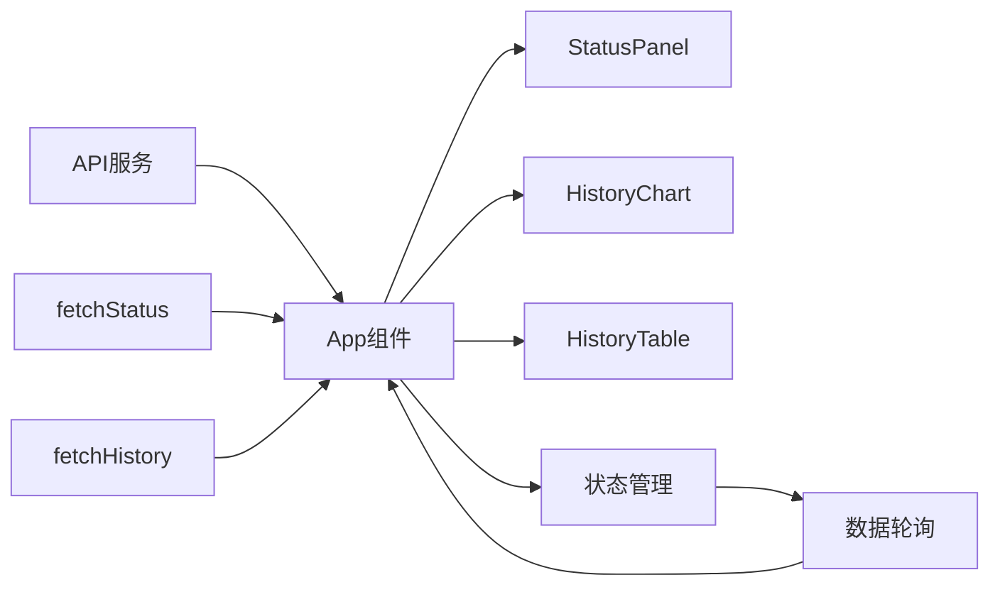

# 车间环境监控系统 - 组件文档

> 📖 **相关文档**: [项目概述](../README.md) | [API接口文档](API.md) | [开发指南](DEVELOPMENT.md) | [文档中心](README.md)

## 目录

1. [组件概述和架构](#组件概述和架构)
2. [组件详细说明](#组件详细说明)
   - [StatusPanel - 实时状态面板](#statuspanel---实时状态面板)
   - [HistoryChart - 历史数据图表](#historychart---历史数据图表)
   - [HistoryTable - 历史数据表格](#historytable---历史数据表格)
3. [组件间的通信和数据流](#组件间的通信和数据流)
4. [组件使用示例](#组件使用示例)
5. [自定义和扩展指南](#自定义和扩展指南)
6. [性能优化建议](#性能优化建议)
7. [测试指南](#测试指南)

## 组件概述和架构

车间环境监控系统采用组件化架构，由三个主要组件构成，每个组件负责特定的功能领域：



### 组件职责

- **StatusPanel**: 显示车间环境的实时状态数据，包括温度、湿度、烟雾水平、风扇状态等
- **HistoryChart**: 以图表形式展示历史数据趋势，支持多指标对比
- **HistoryTable**: 以表格形式展示详细的历史数据记录

### 技术栈

- **React**: 基于函数组件和Hooks的现代React开发
- **TypeScript**: 提供类型安全和更好的开发体验
- **Tailwind CSS**: 实用优先的CSS框架，用于快速构建响应式UI
- **Recharts**: 用于数据可视化的React图表库

## 组件详细说明

### StatusPanel - 实时状态面板

#### 组件功能和用途

[`StatusPanel`](src/components/StatusPanel.tsx:11) 组件负责显示车间环境的实时状态数据，包括温度、湿度、烟雾水平、风扇状态、风扇速度和警报状态。该组件采用卡片式布局，每个指标都有独立的显示区域，并通过颜色编码直观地表示数据状态。

#### Props接口和类型定义

```typescript
interface StatusPanelProps {
  data: StatusData | null;    // 状态数据对象
  isLoading: boolean;         // 加载状态
  error: string | null;       // 错误信息
}
```

其中 [`StatusData`](src/types/index.ts:4) 类型定义如下：

```typescript
export interface StatusData {
  temperature: number;    // 温度 (°C)
  humidity: number;       // 湿度 (%)
  smoke_level: number;    // 烟雾水平 (ppm)
  fan_on: boolean;        // 风扇是否开启
  fan_speed: number;      // 风扇速度 (0-1)
  warning_on: boolean;    // 警报是否触发
}
```

#### 状态管理

[`StatusPanel`](src/components/StatusPanel.tsx:11) 是一个纯展示组件，不管理内部状态。所有状态通过Props从父组件传入，包括：

- `data`: 当前状态数据
- `isLoading`: 加载状态，用于显示加载动画
- `error`: 错误状态，用于显示错误信息

#### 生命周期方法

作为函数组件，[`StatusPanel`](src/components/StatusPanel.tsx:11) 使用React Hooks处理副作用。该组件没有内部副作用，所有数据获取和状态管理由父组件 [`App.tsx`](src/App.tsx:10) 负责。

#### 样式和UI设计

[`StatusPanel`](src/components/StatusPanel.tsx:11) 使用Tailwind CSS实现响应式设计：

- **容器样式**: 使用 `bg-white/70 backdrop-blur-md` 创建半透明毛玻璃效果
- **网格布局**: 使用 `grid grid-cols-1 md:grid-cols-2 lg:grid-cols-3` 实现响应式网格
- **卡片样式**: 每个指标使用独立的卡片，带有悬停效果 `hover:shadow-md`
- **进度条**: 使用动态宽度的div元素实现可视化进度条
- **颜色编码**: 根据数值范围动态应用不同的颜色类

#### 交互行为

- **悬停效果**: 卡片具有悬停时的阴影变化效果
- **动画效果**: 进度条具有平滑的过渡动画 `transition-all duration-500`
- **状态指示**: 风扇和警报状态使用脉冲动画 `animate-pulse` 表示活动状态

### HistoryChart - 历史数据图表

#### 组件功能和用途

[`HistoryChart`](src/components/HistoryChart.tsx:21) 组件使用Recharts库将历史数据以折线图形式展示，支持温度、湿度和烟雾水平三个指标的趋势分析。图表底部还提供了最新值的快速预览卡片。

#### Props接口和类型定义

```typescript
interface HistoryChartProps {
  data: HistoryDataItem[] | null;  // 历史数据数组
  isLoading: boolean;              // 加载状态
  error: string | null;            // 错误信息
}
```

其中 [`HistoryDataItem`](src/types/index.ts:14) 类型定义如下：

```typescript
export interface HistoryDataItem {
  id: number;           // 记录ID
  timestamp: string;    // 时间戳
  temperature: number;  // 温度 (°C)
  humidity: number;     // 湿度 (%)
  smoke_level: number;  // 烟雾水平 (ppm)
  fan_on: boolean;      // 风扇是否开启
  fan_speed: number;    // 风扇速度 (0-1)
  warning_on: boolean;  // 警报是否触发
}
```

#### 状态管理

[`HistoryChart`](src/components/HistoryChart.tsx:21) 是一个纯展示组件，不管理内部状态。所有状态通过Props从父组件传入。

#### 生命周期方法

作为函数组件，[`HistoryChart`](src/components/HistoryChart.tsx:21) 没有内部副作用。数据预处理在渲染过程中进行：

```typescript
// 预处理数据：将时间戳转换为可读格式，并限制显示点数
const chartData = data
  .slice() // 浅拷贝
  .sort((a, b) => new Date(a.timestamp).getTime() - new Date(b.timestamp).getTime())
  .map((item) => ({
    ...item,
    time: new Date(item.timestamp).toLocaleTimeString("zh-CN", {
      hour: "2-digit",
      minute: "2-digit",
      second: "2-digit",
    }),
    fullDate: new Date(item.timestamp).toLocaleString("zh-CN"),
  }));
```

#### 样式和UI设计

- **容器样式**: 使用与StatusPanel相同的半透明毛玻璃效果
- **响应式图表**: 使用 `ResponsiveContainer` 确保图表在不同屏幕尺寸下正确显示
- **自定义工具提示**: 自定义Tooltip样式，提供更友好的数据展示
- **颜色方案**: 温度使用蓝色、湿度使用绿色、烟雾使用紫色

#### 交互行为

- **数据点交互**: 鼠标悬停在数据点上时显示详细信息
- **图例交互**: 点击图例可以显示/隐藏对应的数据线
- **数据抽样**: 当数据点过多时自动进行抽样显示，避免图表过于拥挤

### HistoryTable - 历史数据表格

#### 组件功能和用途

[`HistoryTable`](src/components/HistoryTable.tsx:11) 组件以表格形式展示详细的历史数据记录，支持所有数据字段的展示，并使用颜色编码直观地表示数据状态。

#### Props接口和类型定义

```typescript
interface HistoryTableProps {
  data: HistoryDataItem[] | null;  // 历史数据数组
  isLoading: boolean;              // 加载状态
  error: string | null;            // 错误信息
}
```

#### 状态管理

[`HistoryTable`](src/components/HistoryTable.tsx:11) 是一个纯展示组件，不管理内部状态。所有状态通过Props从父组件传入。

#### 生命周期方法

作为函数组件，[`HistoryTable`](src/components/HistoryTable.tsx:11) 没有内部副作用。数据格式化在渲染过程中进行：

```typescript
// 格式化时间戳
const formatTimestamp = (timestamp: string) => {
  const date = new Date(timestamp);
  return date.toLocaleString("zh-CN", {
    year: "numeric",
    month: "2-digit",
    day: "2-digit",
    hour: "2-digit",
    minute: "2-digit",
    second: "2-digit",
  });
};
```

#### 样式和UI设计

- **响应式表格**: 使用 `overflow-x-auto` 确保在小屏幕上可以水平滚动
- **斑马纹**: 使用交替行背景色提高可读性
- **颜色编码**: 根据数值范围动态应用不同的颜色类
- **状态指示器**: 使用圆点和颜色组合表示布尔状态

#### 交互行为

- **行悬停效果**: 表格行具有悬停时的背景色变化效果
- **状态可视化**: 布尔值使用带有状态指示器的标签显示
- **进度条可视化**: 风扇速度使用小型进度条直观显示

## 组件间的通信和数据流

### 数据流向



### 数据获取流程

1. **初始化**: [`App`](src/App.tsx:10) 组件在挂载时调用 [`fetchStatus()`](src/services/api.ts:11) 和 [`fetchHistory()`](src/services/api.ts:23)
2. **状态轮询**: 设置定时器，每3秒更新状态数据，每30秒更新历史数据
3. **错误处理**: 捕获API错误并设置相应的错误状态
4. **数据传递**: 将获取的数据和状态传递给各个子组件

### 组件通信模式

- **单向数据流**: 数据从父组件 [`App`](src/App.tsx:10) 流向子组件
- **Props传递**: 所有子组件通过Props接收数据和状态
- **状态提升**: 所有状态管理集中在 [`App`](src/App.tsx:10) 组件中

## 组件使用示例

### 基本使用

```typescript
import { StatusPanel, HistoryChart, HistoryTable } from './components';
import { fetchStatus, fetchHistory } from './services/api';

function App() {
  const [statusData, setStatusData] = useState(null);
  const [historyData, setHistoryData] = useState(null);
  const [loading, setLoading] = useState(true);
  const [error, setError] = useState(null);

  useEffect(() => {
    const loadData = async () => {
      try {
        setLoading(true);
        const [status, history] = await Promise.all([
          fetchStatus(),
          fetchHistory(25)
        ]);
        setStatusData(status);
        setHistoryData(history);
      } catch (err) {
        setError(err.message);
      } finally {
        setLoading(false);
      }
    };

    loadData();
  }, []);

  return (
    <div>
      <StatusPanel data={statusData} isLoading={loading} error={error} />
      <HistoryChart data={historyData} isLoading={loading} error={error} />
      <HistoryTable data={historyData} isLoading={loading} error={error} />
    </div>
  );
}
```

### 自定义样式示例

```typescript
// 自定义StatusPanel样式
<StatusPanel 
  data={statusData} 
  isLoading={loading} 
  error={error}
  className="custom-status-panel"
/>

// 对应的CSS
.custom-status-panel {
  background: rgba(255, 255, 255, 0.9);
  border-radius: 16px;
  box-shadow: 0 10px 25px rgba(0, 0, 0, 0.1);
}
```

## 自定义和扩展指南

### 添加新的数据指标

1. **更新类型定义**:

```typescript
// 在 src/types/index.ts 中添加新字段
export interface StatusData {
  // 现有字段...
  air_quality: number;  // 新增空气质量指标
}

export interface HistoryDataItem {
  // 现有字段...
  air_quality: number;  // 新增空气质量指标
}
```

2. **更新StatusPanel组件**:

```typescript
// 在StatusPanel中添加新的指标卡片
<div className="bg-teal-50/70 backdrop-blur-sm rounded-lg p-4 border border-teal-100/50">
  <div className="flex items-center justify-between mb-2">
    <p className="text-gray-600 text-sm font-medium">空气质量</p>
    {/* 图标 */}
  </div>
  <p className="text-2xl font-bold text-teal-600">
    {data.air_quality.toFixed(1)}
  </p>
  {/* 进度条或其他可视化 */}
</div>
```

3. **更新HistoryChart组件**:

```typescript
// 在HistoryChart中添加新的数据线
<Line
  type="monotone"
  dataKey="air_quality"
  stroke="#14b8a6"
  strokeWidth={2}
  dot={{ r: 2 }}
  activeDot={{ r: 6, strokeWidth: 0 }}
  name="air_quality"
/>
```

4. **更新HistoryTable组件**:

```typescript
// 在HistoryTable中添加新的列
<th className="px-6 py-4 text-left text-xs font-semibold text-gray-700 uppercase tracking-wider">
  空气质量
</th>
{/* 对应的数据单元格 */}
```

### 自定义主题

1. **创建主题配置**:

```typescript
// src/theme.ts
export const theme = {
  colors: {
    primary: '#3b82f6',
    secondary: '#10b981',
    accent: '#8b5cf6',
    danger: '#ef4444',
    warning: '#f59e0b',
  },
  thresholds: {
    temperature: {
      low: 18,
      high: 28,
    },
    humidity: {
      low: 30,
      high: 70,
    },
    smoke: {
      low: 50,
      medium: 100,
    }
  }
};
```

2. **应用主题**:

```typescript
// 在组件中使用主题
import { theme } from '../theme';

const getTempColor = (temp: number) => {
  if (temp < theme.thresholds.temperature.low) return `text-${theme.colors.primary}-600`;
  if (temp > theme.thresholds.temperature.high) return `text-${theme.colors.danger}-600`;
  return `text-${theme.colors.secondary}-600`;
};
```

### 添加新的交互功能

1. **添加数据筛选**:

```typescript
// 在HistoryTable组件中添加筛选功能
const [filter, setFilter] = useState({
  dateRange: null,
  warningOnly: false,
});

const filteredData = data?.filter(item => {
  if (filter.warningOnly && !item.warning_on) return false;
  if (filter.dateRange) {
    const itemDate = new Date(item.timestamp);
    if (itemDate < filter.dateRange.start || itemDate > filter.dateRange.end) return false;
  }
  return true;
});
```

2. **添加数据导出**:

```typescript
// 添加导出功能
const exportToCSV = () => {
  if (!data) return;
  
  const headers = ['时间戳', '温度', '湿度', '烟雾', '风扇状态', '风扇速度', '警报状态'];
  const rows = data.map(item => [
    item.timestamp,
    item.temperature,
    item.humidity,
    item.smoke_level,
    item.fan_on ? '开启' : '关闭',
    item.fan_speed,
    item.warning_on ? '触发' : '正常'
  ]);
  
  const csvContent = [headers, ...rows].map(row => row.join(',')).join('\n');
  const blob = new Blob([csvContent], { type: 'text/csv' });
  const url = URL.createObjectURL(blob);
  const a = document.createElement('a');
  a.href = url;
  a.download = `history_data_${new Date().toISOString()}.csv`;
  a.click();
};
```

## 性能优化建议

### 数据获取优化

1. **使用React.memo优化组件渲染**:

```typescript
export const StatusPanel = React.memo(({ data, isLoading, error }: StatusPanelProps) => {
  // 组件实现
});

export const HistoryChart = React.memo(({ data, isLoading, error }: HistoryChartProps) => {
  // 组件实现
});

export const HistoryTable = React.memo(({ data, isLoading, error }: HistoryTableProps) => {
  // 组件实现
});
```

2. **使用useMemo优化数据处理**:

```typescript
// 在HistoryChart中使用useMemo
const chartData = useMemo(() => {
  if (!data) return [];
  
  return data
    .slice()
    .sort((a, b) => new Date(a.timestamp).getTime() - new Date(b.timestamp).getTime())
    .map((item) => ({
      ...item,
      time: new Date(item.timestamp).toLocaleTimeString("zh-CN", {
        hour: "2-digit",
        minute: "2-digit",
        second: "2-digit",
      }),
      fullDate: new Date(item.timestamp).toLocaleString("zh-CN"),
    }));
}, [data]);

const displayData = useMemo(() => {
  if (chartData.length > 30) {
    return chartData.filter((_, idx) => idx % Math.ceil(chartData.length / 30) === 0);
  }
  return chartData;
}, [chartData]);
```

3. **使用useCallback优化事件处理**:

```typescript
// 在App组件中使用useCallback
const loadStatus = useCallback(async (isInitial = false) => {
  try {
    if (isInitial && !initialStatusLoaded) {
      setStatusLoading(true);
    }
    setStatusError(null);
    const status = await fetchStatus();
    if (isMounted) {
      setStatusData(status);
      if (isInitial && !initialStatusLoaded) {
        initialStatusLoaded = true;
        setStatusLoading(false);
      }
    }
  } catch (e: unknown) {
    if (isMounted) {
      setStatusError(e instanceof Error ? e.message : "未知错误");
      if (isInitial && !initialStatusLoaded) {
        setStatusLoading(false);
        initialStatusLoaded = true;
      }
    }
  }
}, [isMounted, initialStatusLoaded]);
```

### 渲染优化

1. **虚拟化长列表**:

```typescript
// 对于大量历史数据，考虑使用react-window进行虚拟化
import { FixedSizeList as List } from 'react-window';

const Row = ({ index, style }) => (
  <div style={style}>
    {/* 渲染单行数据 */}
  </div>
);

// 在HistoryTable中使用
<List
  height={600}
  itemCount={data.length}
  itemSize={50}
  width="100%"
>
  {Row}
</List>
```

2. **图表渲染优化**:

```typescript
// 限制图表数据点数量
const MAX_CHART_POINTS = 100;
const limitedData = useMemo(() => {
  if (!data || data.length <= MAX_CHART_POINTS) return data;
  
  // 简单抽样算法
  const step = Math.ceil(data.length / MAX_CHART_POINTS);
  return data.filter((_, index) => index % step === 0);
}, [data]);
```

3. **CSS优化**:

```css
/* 使用transform代替位置变化进行动画 */
.progress-bar {
  transform: scaleX(var(--progress));
  transition: transform 0.5s ease;
}

/* 使用will-change提示浏览器优化 */
.status-card {
  will-change: transform;
}

/* 使用contain属性优化布局 */
.chart-container {
  contain: layout style paint;
}
```

### 内存优化

1. **清理定时器和事件监听器**:

```typescript
useEffect(() => {
  // 设置定时器
  const intervalId = setInterval(() => {
    // 轮询逻辑
  }, 3000);
  
  // 清理函数
  return () => {
    clearInterval(intervalId);
  };
}, []);
```

2. **避免内存泄漏**:

```typescript
// 使用isMounted标志避免组件卸载后更新状态
useEffect(() => {
  let isMounted = true;
  
  const fetchData = async () => {
    const data = await fetchStatus();
    if (isMounted) {
      setStatusData(data);
    }
  };
  
  fetchData();
  
  return () => {
    isMounted = false;
  };
}, []);
```

## 测试指南

### 单元测试

1. **StatusPanel组件测试**:

```typescript
// src/components/__tests__/StatusPanel.test.tsx
import { render, screen } from '@testing-library/react';
import { StatusPanel } from '../StatusPanel';
import type { StatusData } from '../../types';

describe('StatusPanel', () => {
  const mockData: StatusData = {
    temperature: 25.5,
    humidity: 60.2,
    smoke_level: 45.8,
    fan_on: true,
    fan_speed: 0.75,
    warning_on: false,
  };

  it('renders status data correctly', () => {
    render(<StatusPanel data={mockData} isLoading={false} error={null} />);
    
    expect(screen.getByText('25.5 °C')).toBeInTheDocument();
    expect(screen.getByText('60.2 %')).toBeInTheDocument();
    expect(screen.getByText('45.8 ppm')).toBeInTheDocument();
    expect(screen.getByText('运行中')).toBeInTheDocument();
    expect(screen.getByText('75 %')).toBeInTheDocument();
    expect(screen.getByText('正常')).toBeInTheDocument();
  });

  it('shows loading state', () => {
    render(<StatusPanel data={null} isLoading={true} error={null} />);
    
    expect(screen.getByText('加载状态数据中...')).toBeInTheDocument();
  });

  it('shows error state', () => {
    render(<StatusPanel data={null} isLoading={false} error="Network error" />);
    
    expect(screen.getByText('错误: Network error')).toBeInTheDocument();
  });

  it('shows no data state', () => {
    render(<StatusPanel data={null} isLoading={false} error={null} />);
    
    expect(screen.getByText('暂无状态数据')).toBeInTheDocument();
  });
});
```

2. **HistoryChart组件测试**:

```typescript
// src/components/__tests__/HistoryChart.test.tsx
import { render, screen } from '@testing-library/react';
import { HistoryChart } from '../HistoryChart';
import type { HistoryDataItem } from '../../types';

describe('HistoryChart', () => {
  const mockData: HistoryDataItem[] = [
    {
      id: 1,
      timestamp: '2023-01-01T12:00:00Z',
      temperature: 25.5,
      humidity: 60.2,
      smoke_level: 45.8,
      fan_on: true,
      fan_speed: 0.75,
      warning_on: false,
    },
    // 更多测试数据...
  ];

  it('renders chart with data', () => {
    render(<HistoryChart data={mockData} isLoading={false} error={null} />);
    
    expect(screen.getByText('历史数据趋势图')).toBeInTheDocument();
    expect(screen.getByText('显示 2 个数据点（共 2 条）')).toBeInTheDocument();
  });

  it('shows loading state', () => {
    render(<HistoryChart data={null} isLoading={true} error={null} />);
    
    expect(screen.getByText('加载图表数据中...')).toBeInTheDocument();
  });

  it('shows error state', () => {
    render(<HistoryChart data={null} isLoading={false} error="Network error" />);
    
    expect(screen.getByText('图表错误: Network error')).toBeInTheDocument();
  });
});
```

3. **HistoryTable组件测试**:

```typescript
// src/components/__tests__/HistoryTable.test.tsx
import { render, screen } from '@testing-library/react';
import { HistoryTable } from '../HistoryTable';
import type { HistoryDataItem } from '../../types';

describe('HistoryTable', () => {
  const mockData: HistoryDataItem[] = [
    {
      id: 1,
      timestamp: '2023-01-01T12:00:00Z',
      temperature: 25.5,
      humidity: 60.2,
      smoke_level: 45.8,
      fan_on: true,
      fan_speed: 0.75,
      warning_on: false,
    },
    // 更多测试数据...
  ];

  it('renders table with data', () => {
    render(<HistoryTable data={mockData} isLoading={false} error={null} />);
    
    expect(screen.getByText('历史数据')).toBeInTheDocument();
    expect(screen.getByText('共 2 条记录')).toBeInTheDocument();
    expect(screen.getByText('25.5')).toBeInTheDocument();
    expect(screen.getByText('60.2')).toBeInTheDocument();
  });

  it('formats timestamp correctly', () => {
    render(<HistoryTable data={mockData} isLoading={false} error={null} />);
    
    expect(screen.getByText(/2023\/01\/01/)).toBeInTheDocument();
  });
});
```

### 集成测试

```typescript
// src/__tests__/App.integration.test.tsx
import { render, screen, waitFor } from '@testing-library/react';
import App from '../App';
import { fetchStatus, fetchHistory } from '../services/api';

// Mock API calls
jest.mock('../services/api');
const mockFetchStatus = fetchStatus as jest.MockedFunction<typeof fetchStatus>;
const mockFetchHistory = fetchHistory as jest.MockedFunction<typeof fetchHistory>;

describe('App Integration', () => {
  beforeEach(() => {
    jest.clearAllMocks();
  });

  it('loads and displays data', async () => {
    const mockStatusData = {
      temperature: 25.5,
      humidity: 60.2,
      smoke_level: 45.8,
      fan_on: true,
      fan_speed: 0.75,
      warning_on: false,
    };

    const mockHistoryData = [
      {
        id: 1,
        timestamp: '2023-01-01T12:00:00Z',
        temperature: 25.5,
        humidity: 60.2,
        smoke_level: 45.8,
        fan_on: true,
        fan_speed: 0.75,
        warning_on: false,
      },
    ];

    mockFetchStatus.mockResolvedValue(mockStatusData);
    mockFetchHistory.mockResolvedValue(mockHistoryData);

    render(<App />);

    // 等待数据加载
    await waitFor(() => {
      expect(screen.getByText('25.5 °C')).toBeInTheDocument();
    });

    await waitFor(() => {
      expect(screen.getByText('历史数据趋势图')).toBeInTheDocument();
    });

    await waitFor(() => {
      expect(screen.getByText('共 1 条记录')).toBeInTheDocument();
    });
  });

  it('handles API errors', async () => {
    mockFetchStatus.mockRejectedValue(new Error('Network error'));
    mockFetchHistory.mockRejectedValue(new Error('Network error'));

    render(<App />);

    await waitFor(() => {
      expect(screen.getByText(/错误:/)).toBeInTheDocument();
    });
  });
});
```

### 端到端测试

```typescript
// cypress/e2e/dashboard.cy.ts
describe('Dashboard E2E', () => {
  beforeEach(() => {
    // 拦截API请求并返回模拟数据
    cy.intercept('GET', 'http://192.168.3.16:8000/status', {
      fixture: 'status.json',
    }).as('getStatus');

    cy.intercept('GET', 'http://192.168.3.16:8000/history*', {
      fixture: 'history.json',
    }).as('getHistory');

    cy.visit('/');
  });

  it('displays dashboard with data', () => {
    cy.wait('@getStatus');
    cy.wait('@getHistory');

    // 验证状态面板
    cy.contains('当前状态').should('be.visible');
    cy.contains('25.5 °C').should('be.visible');
    cy.contains('60.2 %').should('be.visible');
    cy.contains('45.8 ppm').should('be.visible');
    cy.contains('运行中').should('be.visible');
    cy.contains('75 %').should('be.visible');
    cy.contains('正常').should('be.visible');

    // 验证历史图表
    cy.contains('历史数据趋势图').should('be.visible');

    // 验证历史表格
    cy.contains('历史数据').should('be.visible');
    cy.contains('共 25 条记录').should('be.visible');
  });

  it('handles data refresh', () => {
    cy.wait('@getStatus');
    cy.wait('@getHistory');

    // 等待自动刷新
    cy.wait(3000);

    // 验证API被再次调用
    cy.get('@getStatus').should('have.callCount', 2);
  });
});
```

### 测试数据准备

```json
// cypress/fixtures/status.json
{
  "temperature": 25.5,
  "humidity": 60.2,
  "smoke_level": 45.8,
  "fan_on": true,
  "fan_speed": 0.75,
  "warning_on": false
}
```

```json
// cypress/fixtures/history.json
[
  {
    "id": 1,
    "timestamp": "2023-01-01T12:00:00Z",
    "temperature": 25.5,
    "humidity": 60.2,
    "smoke_level": 45.8,
    "fan_on": true,
    "fan_speed": 0.75,
    "warning_on": false
  },
  {
    "id": 2,
    "timestamp": "2023-01-01T12:01:00Z",
    "temperature": 25.7,
    "humidity": 60.5,
    "smoke_level": 46.2,
    "fan_on": true,
    "fan_speed": 0.78,
    "warning_on": false
  }
]
```

### 测试覆盖率

确保测试覆盖以下场景：

1. **正常数据渲染**
2. **加载状态显示**
3. **错误状态处理**
4. **空数据处理**
5. **数据格式化**
6. **用户交互**
7. **响应式布局**
8. **数据轮询**
9. **组件生命周期**
10. **边界条件处理**

使用Jest的覆盖率报告确保测试覆盖率达到80%以上：

```bash
# 运行测试并生成覆盖率报告
npm test -- --coverage --watchAll=false

# 查看覆盖率报告
open coverage/lcov-report/index.html
```

## 📚 相关文档

- [项目概述](../README.md) - 了解项目基本情况和功能特性
- [API接口文档](API.md) - 了解API接口的详细说明
- [开发指南](DEVELOPMENT.md) - 了解开发环境设置和项目配置
- [文档中心](README.md) - 查看所有文档的导航索引