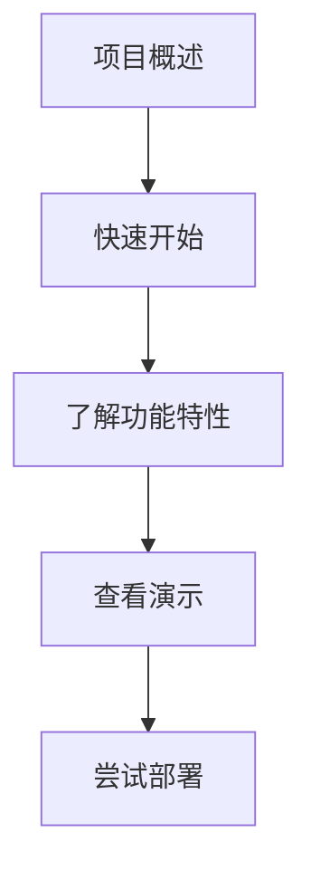
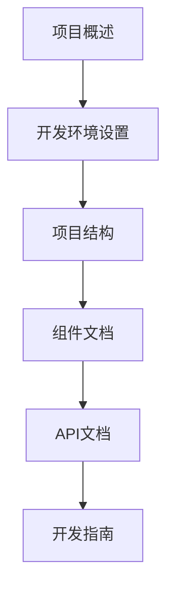
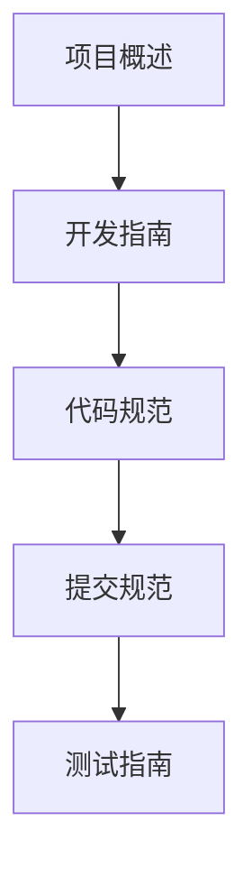

# 车间环境监控系统 - 文档中心

欢迎来到车间环境监控系统项目的文档中心！这里包含了项目的所有详细文档，帮助您快速了解和使用系统。

## 📚 文档导航

### 🚀 快速开始

如果您是第一次接触本项目，建议按照以下顺序阅读文档：

1. **[项目概述](../README.md)** - 了解项目基本情况和快速开始
2. **[API接口文档](API.md)** - 了解系统提供的API接口
3. **[组件文档](COMPONENTS.md)** - 了解前端组件的详细说明
4. **[开发指南](DEVELOPMENT.md)** - 了解如何参与开发

### 📖 文档列表

| 文档 | 描述 | 适用人群 |
|------|------|----------|
| [项目概述](../README.md) | 项目介绍、功能特性和快速开始指南 | 所有用户 |
| [API接口文档](API.md) | 详细的API接口说明、请求格式和响应示例 | 前端开发者、后端开发者 |
| [组件文档](COMPONENTS.md) | 前端组件的详细说明、使用方法和扩展指南 | 前端开发者 |
| [开发指南](DEVELOPMENT.md) | 开发环境设置、项目配置和开发工作流 | 开发者、贡献者 |

### 🔍 快速导航

#### 按角色查找文档

**产品经理/项目经理**
- [项目概述](../README.md#-功能特性) - 了解系统功能
- [API接口文档](API.md#api概述) - 了解系统能力

**前端开发者**
- [组件文档](COMPONENTS.md#组件概述和架构) - 了解组件架构
- [API接口文档](API.md#使用示例) - 了解API使用方法
- [开发指南](DEVELOPMENT.md#开发环境设置) - 设置开发环境

**后端开发者**
- [API接口文档](API.md#api端点) - 了解API规范
- [开发指南](DEVELOPMENT.md#项目配置详解) - 了解项目配置

**运维人员**
- [开发指南](DEVELOPMENT.md#部署指南) - 了解部署流程
- [API接口文档](API.md#api限制和注意事项) - 了解系统限制

#### 按需求查找文档

**了解系统功能**
- [项目概述](../README.md#-功能特性)
- [组件文档](COMPONENTS.md#组件详细说明)

**集成API接口**
- [API接口文档](API.md#api端点)
- [API接口文档](API.md#使用示例)

**开发新功能**
- [开发指南](DEVELOPMENT.md#扩展开发)
- [组件文档](COMPONENTS.md#自定义和扩展指南)

**部署系统**
- [开发指南](DEVELOPMENT.md#部署指南)
- [开发指南](DEVELOPMENT.md#环境变量管理)

**性能优化**
- [开发指南](DEVELOPMENT.md#性能优化)
- [组件文档](COMPONENTS.md#性能优化建议)

## 📋 文档阅读顺序建议

### 新用户入门路径

**推荐阅读顺序：**
1. [项目概述](../README.md) - 了解项目基本情况
2. [快速开始](../README.md#-快速开始) - 快速部署和运行系统
3. [功能特性](../README.md#-功能特性) - 了解系统提供的功能
4. [API接口文档](API.md#api概述) - 了解API接口

### 开发者路径

**推荐阅读顺序：**
1. [项目概述](../README.md) - 了解项目基本情况
2. [开发环境设置](DEVELOPMENT.md#开发环境设置) - 设置开发环境
3. [项目结构](../README.md#-项目结构) - 了解代码组织
4. [组件文档](COMPONENTS.md) - 了解前端组件
5. [API接口文档](API.md) - 了解API接口
6. [开发指南](DEVELOPMENT.md) - 深入了解开发流程

### 贡献者路径

**推荐阅读顺序：**
1. [项目概述](../README.md) - 了解项目基本情况
2. [开发指南](DEVELOPMENT.md) - 了解开发流程
3. [代码规范](DEVELOPMENT.md#代码规范和代码规范) - 了解代码规范
4. [提交规范](DEVELOPMENT.md#代码提交规范) - 了解提交规范
5. [测试指南](COMPONENTS.md#测试指南) - 了解测试方法

## 🔗 相关链接

### 项目资源

- **GitHub仓库**: [项目主页](https://github.com/your-username/learn-vite-react)
- **问题反馈**: [GitHub Issues](https://github.com/your-username/learn-vite-react/issues)
- **更新日志**: [CHANGELOG.md](../CHANGELOG.md) (如果存在)

### 技术栈文档

- **React**: [官方文档](https://react.dev/)
- **Vite**: [官方文档](https://vite.dev/)
- **TypeScript**: [官方文档](https://www.typescriptlang.org/)
- **Tailwind CSS**: [官方文档](https://tailwindcss.com/)
- **Recharts**: [官方文档](https://recharts.org/)

### 开发工具

- **VS Code**: [下载地址](https://code.visualstudio.com/)
- **Node.js**: [下载地址](https://nodejs.org/)
- **pnpm**: [安装指南](https://pnpm.io/installation)

## 📝 文档贡献

我们欢迎所有形式的文档贡献！如果您发现文档中的错误、遗漏或有改进建议，请：

1. **提交Issue**: 在GitHub上提交文档相关问题
2. **提交PR**: 直接修改文档并提交Pull Request
3. **联系维护者**: 通过邮件或其他方式联系项目维护者

### 文档规范

- 使用Markdown格式编写
- 保持简洁明了的语言风格
- 添加适当的代码示例
- 确保所有链接有效
- 保持文档结构清晰

## 📊 文档状态

| 文档 | 状态 | 最后更新 | 维护者 |
|------|------|----------|--------|
| [项目概述](../README.md) | ✅ 最新 | 2023-12-26 | 项目团队 |
| [API接口文档](API.md) | ✅ 最新 | 2023-12-26 | 后端团队 |
| [组件文档](COMPONENTS.md) | ✅ 最新 | 2023-12-26 | 前端团队 |
| [开发指南](DEVELOPMENT.md) | ✅ 最新 | 2023-12-26 | 开发团队 |

## ❓ 常见问题

### Q: 如何快速开始使用系统？
A: 请参考[项目概述](../README.md#-快速开始)中的快速开始指南。

### Q: API接口如何使用？
A: 请参考[API接口文档](API.md#使用示例)中的详细示例。

### Q: 如何添加新的组件？
A: 请参考[组件文档](COMPONENTS.md#自定义和扩展指南)中的扩展指南。

### Q: 如何部署到生产环境？
A: 请参考[开发指南](DEVELOPMENT.md#部署指南)中的部署流程。

### Q: 遇到问题如何寻求帮助？
A: 您可以通过[GitHub Issues](https://github.com/your-username/learn-vite-react/issues)提交问题，或联系项目维护者。

---

**注意**: 本文档中心会随着项目的发展持续更新，请定期查看最新版本。

如有任何问题或建议，请随时联系我们！